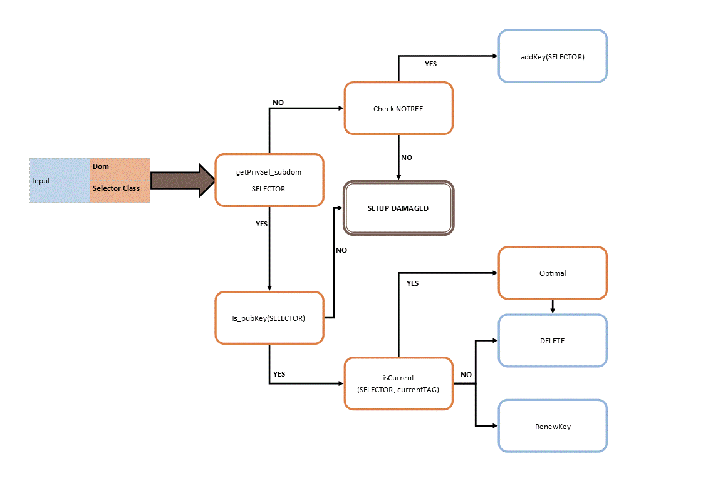

# DMARC Assistant

This is a tool written in PHP to manage SPF, DKIM and DMARC setup in multidomain environment.

## Abstract
DMARC Assistant offers a setup manager for SPF, DKIM and DMARC record using predefined templates. It adds the records to your nameservers.

It also maintains the DKIM keys (SigningTable and KeyTable, **OpenDKIM required**), and it periodically renews them, keeping old ones for a while.

DMARC Assistant tries to govern your setup and it warns about anomalies.
Every activity is tracked via syslog.

## DKIM model
You can have different SMTP servers, each signing with different selectors and keys.

DMARC Assistant creates selector and keys for you, and it writes the DNS record on your nameservers. 

We define multiple **Selector Class**, which are a prefix for each selector associated to particular servers set.
Then we build selector as `<selector class>-<hash>`
The hash depends on:

- FQDN domain name
- time slot

The time slot is defined in `[selector][scheme][period]` of _dkim.conf_ and can be yearly, montly or weekly.
At the end of this period the keys are replaced by a new pair.

When a pair of key has replaced, the old public key is maintained for a `[delay time][interval]` to allow validation of any deferred mails.

You can setup any subdomains which sign with parent domain keys and they have an own **AUID**.
You can also set an AUID for a single email address.

Of course, to be DMARC friendly, every domain must have at least a dedicated pair of key. Subdomains could use the parent domain keys in relaxed DMARC fashion.



## Prerequisites:
1. You are a domain DNS manager and a mail provider for one or multiple domains.
2. Sign your mails with **OpenDKIM** with *SigningTable* and *KeyTable* over LDAP

## Requisite:

1. PHP 5.5 or greather. Suggested PHP 7.
2. php-ldap.
3. php-mysql, only if you configure MySQL driver for delayed delete.
4. nsupdate
	- install it with __yum install bind-utils__.
	- grant IP access via nspudate to nameservers.
5. a local installed OpenDKIM with at least *opendkim-genkey* and a default running config. The OpenDKIMs used by your SMTP server can be different from this one.
6. web server - Apache HTTPD has been tested - with SSL and authenticated access.
7. DNS Server configured to be accessed by nsupdate (IP acl).
8. LDAP Server with
	- track modification operational attributes enabled.
	- Class of Service supported.


## Install:

1. Add the schema _doc/96opendkim.ldif_ to your LDAP Directory server.
This schema is a modified version of standard OpenDKIM LDAP schema, with only **DKIMSelector** attribute mandatory.

2. Initialize a new tree on your LDAP server using _doc/dkim\_initialize.ldif_.
Enter this file and change any password, password policy references and selector class.

3. Set **date.timezone** in _php.ini_ to ensure work of timing functions.

4. Suggested LDAP indexes:
	- cn: equality, presence, substring
	- dkimDomain: presence
	- dkimIdentity: presence
	- dkimKey: presence
	- mail: equality, presence
	- mailAlternateAddress: equality
	- mdRecord: presence
	- ou: presence
	- uid: presence

5. Setup your HTTP Server with SSL and authenticated access.
For instance, if you have Apache HTTPD Server:
	- __yum install httpd mod_ssl__
	- vi _/etc/httpd/conf.d/90access.conf_:

		    <AuthnProviderAlias ldap authservice>
		   AuthLDAPBindDN uid=proxy,c=en
		   AuthLDAPBindPassword ******
		   AuthLDAPURL ldap://localhost:389/c=en?uid
		</AuthnProviderAlias>
    
		<AuthzProviderAlias ldap-group serviceUsers cn=groupaccess,c=en>
			AuthLDAPBindDN uid=proxy,c=en
			AuthLDAPBindPassword *******
			AuthLDAPURL ldap://localhost:389/c=en?uid
		</AuthzProviderAlias>
    
		<Directory /var/www/html/dmarcsetup>
			Options FollowSymLinks
			AllowOverride None
			AuthBasicProvider authservice
			AuthName "Welcome on DMARC Assistant"
			AuthType basic
			<RequireAny>
				Require serviceUsers
			</RequireAny>
		</Directory>
		
6. Clone, then from the home directory 
`composer require jeremykendall/php-domain-parser`

7. The root folder has to be owned by the system user running the web server.
For instance:
```
chown apache dmarc-setup-assistant
```
8. `cp -p ldap.conf_default ldap.conf` and configure it as expected in _dkim\_initialize.ldif_. Also, set username and password to bind.
	- The [delaydel] section is meaningful only if you set `ldap =  TRUE` in `[delay driver]` of *dkim.conf*.
9. `cp -p dkim.conf_default dkim.conf` and configure it as expected in _dkim\_initialize.ldif_. In particular, you may want to change the Selector Classes and time slot.
	- pay attention. If you change a Selector class, you must manually update the LDIF file _dkim\_initialize.ldif_ accordingly. For instance, if you add the Selector Class "alice", the you must add on the LDAP server:
	
		    dn: ou=alice,o=dkim
		ou: alice
		objectClass: top
		objectClass: organizationalunit

10. `cp -p db.conf_default db.conf` only if you want delay driver over mysql. Set credential, table and field names.
11. `cp -p dmarc.conf_default dmarc.conf`. This file comes with default RFC7489 values which are not written to the DMARC record. Usually, there are no reasons to modify this file.
12. `cp -p ns.conf_default ns.conf`.
	- Insert in `ns[]` the authotitative name servers of your domains.
	- Insert in `[nsupdate][name]` the nameservers "internal" and or "external" where nsupdate write to. You can set only "internal", "external" or both. If you set both servers, DMARC Assistant try to write the same record to "internal" server and to "external" server too.
13. `cp -p system.conf_default system.conf`. Configure some detail about syslog and path of *opendkim-genkey*. Also set the default SPF and DMARC records.
	1. If `template = FALSE` the GUI provides the ability to directly write the record. This could be dangerous.
	2. If `template = TRUE` the GUI provides a standard template within you can write the record.
14. `cp -p spf_config.php_default spf_config.php`. While we don't suggest to modify `$qualifiers` array, you probably must arrange the `$modifiers`. This last one is an array of SPF modifiers which will appear in SPF template. For instance, if you add a modifier like `include:_spfbulk.example.com`, then if your cure to provide a DNS record for that.
15. Enter the web site and click on Info link on the right upper corner. Check at your setup.
	- For your convenience, you could erase the file setup.php after you checked the info provided. Or you could change the permission to 000 (`chmod 000 setup.php`).

## Scheduling
You must schedule two operations:

1. DKIM Delayed del keys. Public DKIM keys no longer in use, but still existing to permit verification.
2. DKIM Keys Renewal task

### DKIM Delayed Del
This task is performed by *DKIMDeleteRecord.php*. It returns 0 if no errors occur.
You could use this timer:

*dmarcAssistDelkey.timer*

    ### DKIM Delayed Keys removal timer ###
    #
    # DMARCAssistant automatically delete your DKIM delayed deleted keys
    
    [Unit]
    Description=DKIM Delayed Deleted Keys removal timer
    After=syslog.target network.target
    
    [Timer]
    OnCalendar=daily
    
    [Install]
    WantedBy=httpd.service

*dmarcAssistDelkey.service*

    ### DKIM Delayed Keys Removal ###
    #
    
    [Unit]
    Description=DKIM Delayed Public Keys Delete Service
    After=syslog.target network.target
    
    [Service]
    User=root
    ExecStart=/var/www/html/dmarcsetup/DKIMDeleteRecord.php
    SuccessExitStatus=0

### DKIM Keys Renewal task
This task is performed by *DKIMtimer.php*. To ensure starting after the time slot change, the script waits randomly from five minutes to an hours before renew the keys. In this way you can use this timer:

*dmarcAssistRenkey.timer*

    ### DKIM Keys update timer ###
    #
    # DMARCAssistant automatically updates your DKIM active keys
    
    [Unit]
    Description=DKIM Keys Update timer
    After=syslog.target network.target
    
    [Timer]
    OnCalendar=weekly
    
    [Install]
    WantedBy=httpd.service

*dmarcAssistRenkey.service*

    ### DKIM Keys Renew ###
    #
    
    [Unit]
    Description=DKIM Keys Update Service
    After=syslog.target network.target
    
    [Service]
    User=root
    ExecStart=/var/www/html/dmarcsetup/DKIMtimer.php
    SuccessExitStatus=0

You are free to use crontab instead. You could be interested to remember that "weekly" timer is not synchronized to "weekly" crontab ;-)

## GUI Usage:

You can:

1. Setup initial SPF record
2. Setup initial DKIM record, keys and selectors
3. Setup inizial DMARC record
4. Change SPF and DMARC records
5. About DKIM you can:
	1. manage Selector Classes
	2. manage subdomains which sign using parent domain keys
	3. manage AUIDs associated to a single email addresses.
	4. check the state of keys in current time slot.
	5. check setup anomalies
	


----------

### Setup Operation Mode

DMARC Assistant offers two setup mode:

1. Relaxed
2. Strict

*Relaxed mode* (default) is the easiest way if you have many subdomain and you want to manage them with one DKIM signature, one DMARC record with relaxed DKIM alignment. If you enter a subdomain, the GUI shows the corresponding Organizational domain for DKIM and DMARC and you can't manage subdomains (with the exception of SPF).

*Strict mode* let you to manage DKIM, DMARC and SPF record for each subdomain. This is the more flexible way. It is useful only if:

1. you want different signatures for each subdomain of the same Organizational domain.
2. you choose strict DKIM alignment in DMARC policy, so see at above.
3. you want deeply customize DMARC records for each subdomain.

Remember that with Strict setup mode you could suffer managing your domains. You could really complicate your life! You could fall in disgrace, remember this.

#### Disclaimer ####
You find here **only a minimal description**. A more detailed documentation will come... soon...

Use with care, at your own risk.
